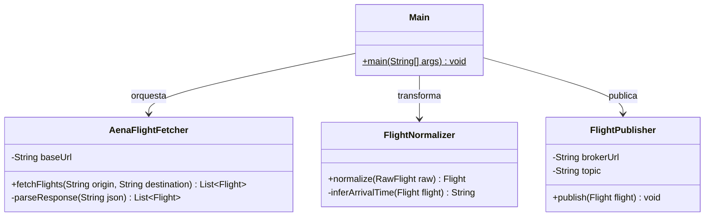
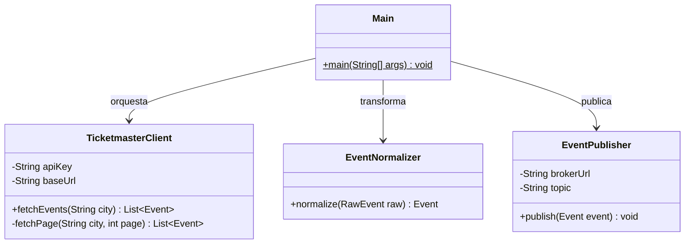
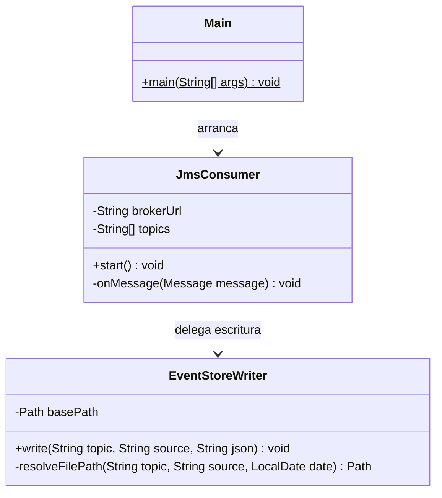
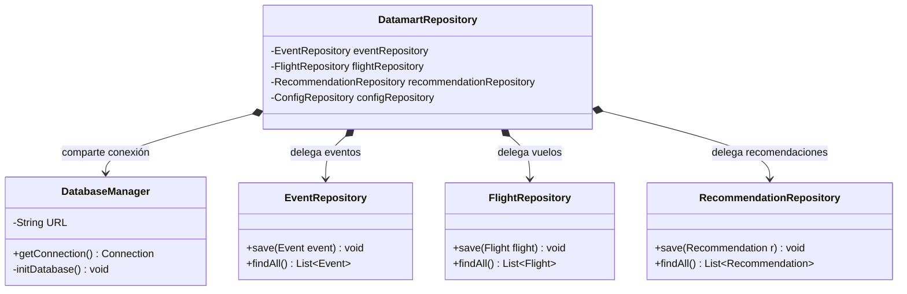
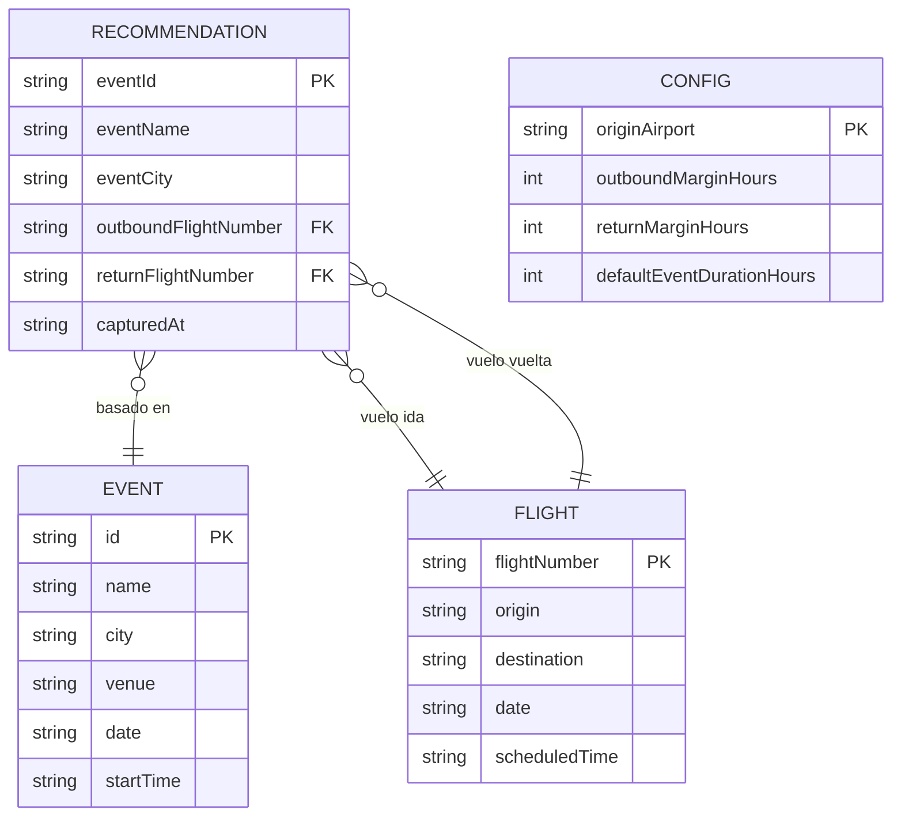

# Sistema de Recomendación de Viajes para Eventos Musicales

Proyecto final de la asignatura **Desarrollo de Aplicaciones para Ciencia de Datos (DACD)**, Universidad de Las Palmas de Gran Canaria.

## Integrantes

- **Marcos Pérez Pérez**
- **César Luis Saavedra Vaca**

---

## 1. Descripción y Propuesta de Valor

Este proyecto implementa una arquitectura distribuida para capturar, almacenar, procesar y exponer recomendaciones de viaje asociadas a eventos musicales. El sistema cruza eventos obtenidos desde Ticketmaster con vuelos reales publicados por AENA y genera recomendaciones formadas por:

- un evento musical en Madrid o Barcelona
- un vuelo de ida desde `LPA` hacia la ciudad del evento
- un vuelo de vuelta desde la ciudad del evento hacia `LPA`

### ¿Qué problema resuelve?

Planificar un viaje para asistir a un concierto desde Las Palmas de Gran Canaria implica consultar manualmente múltiples fuentes: buscar qué eventos hay en Madrid o Barcelona, comprobar si existe un vuelo que llegue con suficiente antelación al evento y localizar un vuelo de vuelta que salga después de que termine. Este proceso puede llevar entre 30 minutos y varias horas por evento consultado.

**El sistema automatiza completamente esta tarea.** En una sola interfaz web el usuario ve todos los eventos musicales próximos y, para cada uno, las combinaciones de vuelo ida y vuelta que son compatibles con su horario, sin necesidad de abrir Skyscanner, Google Flights o la web de AENA por separado.

A diferencia de los buscadores de vuelos genéricos, el sistema:

- filtra únicamente vuelos que **lleguen antes del evento** con el margen de tiempo configurado
- filtra únicamente vuelos de vuelta que **salgan después de que termine** el evento
- consolida automáticamente variantes duplicadas del mismo concierto publicadas por Ticketmaster
- descarta eventos auxiliares como parking o paquetes VIP que no tienen interés para el usuario final
- permite reconstruir el histórico completo desde el Event Store sin necesidad de reconectar a las APIs externas

El resultado es un **datamart listo para consumir** a través de una API REST y una interfaz web, con recomendaciones ordenadas de forma determinista y actualizadas en tiempo real cada vez que llegan nuevos vuelos o eventos.

---

## 2. Módulos

El proyecto está organizado como un proyecto Maven multi-módulo.

| Módulo | Responsabilidad |
|---|---|
| `flight-provider` | Consulta vuelos reales en AENA, normaliza los datos y publica mensajes en el topic `Flight`. |
| `ticketmaster-provider` | Consulta eventos musicales en Ticketmaster por ciudad y publica mensajes en el topic `Ticketmaster`. |
| `EventStoreBuilder` | Consume los topics JMS y persiste cada mensaje recibido en ficheros `.events`. |
| `business-unit` | Carga el Event Store, mantiene el datamart SQLite, calcula recomendaciones y expone API REST e interfaz web. |

---

## 3. Arquitectura y Diseño Técnico

El sistema adopta un enfoque orientado a eventos (EDA) acoplado a través de un broker de mensajería asíncrona, un datamart relacional centralizado y un servidor web integrado para la exposición de servicios.

### 3.1. Arquitectura de Sistema (Despliegue)

Los módulos pueden correr en la misma máquina o en equipos distintos. El único requisito es que todos apunten al mismo broker ActiveMQ y que `business-unit` tenga acceso al directorio `eventstore/` generado por `EventStoreBuilder`.

```
┌──────────────────────────────────────────────────────┐
│                     Mismo equipo o red local          │
│                                                       │
│  ┌─────────────────┐     ┌──────────────────────┐    │
│  │ flight-provider  │     │ ticketmaster-provider │    │
│  │  (cada hora)    │     │   (cada 6 horas)     │    │
│  └────────┬────────┘     └──────────┬───────────┘    │
│           │  publica topics JMS     │                 │
│           ▼                         ▼                 │
│  ┌─────────────────────────────────────────────────┐  │
│  │          Apache ActiveMQ  tcp://localhost:61616  │  │
│  └───────────────────┬─────────────────────────────┘  │
│                      │ consume topics                  │
│           ┌──────────┴──────────┐                     │
│           ▼                     ▼                     │
│  ┌─────────────────┐  ┌──────────────────────────┐   │
│  │ EventStoreBuilder│  │      business-unit        │   │
│  │  escribe .events │  │  SQLite + API REST + Web  │   │
│  └────────┬────────┘  └──────────────────────────┘   │
│           │ lee histórico al arrancar                  │
│           └──────────────────────────────────────────► │
│                                                       │
│            http://localhost:7070  ◄── Usuario         │
└──────────────────────────────────────────────────────┘
```

### 3.2. Flujo de Datos General


### 3.3. Arquitectura de Aplicación — `business-unit`


### 3.4. Arquitectura de Aplicación — `flight-provider`



### 3.5. Arquitectura de Aplicación — `ticketmaster-provider`



### 3.6. Arquitectura de Aplicación — `EventStoreBuilder`



### 3.7. Capa de Persistencia (`business-unit`)



---

## 4. Fuentes de Datos

### Justificación de la elección de APIs

Para nutrir el sistema se han seleccionado dos fuentes de datos oficiales y fiables:

**Ticketmaster (Discovery API):** Es el estándar de la industria en venta de entradas en España. Su API REST ofrece un volumen masivo de eventos reales con filtrado granular por ciudad, clasificación musical y paginación, y proporciona metadatos estandarizados (fechas, horas, recintos, URLs). Su gratuidad para uso académico y su estabilidad la hacen idónea para este proyecto.

**AENA (Infovuelos):** Es la fuente oficial de la red de aeropuertos españoles. Garantiza vuelos reales y programados sin las limitaciones, bloqueos o costes habituales de las APIs de aerolíneas individuales (Iberia, Vueling) o los agregadores comerciales (Skyscanner, Kayak), que requieren acuerdos comerciales o imponen rate limits muy estrictos. Al imitar la misma petición `POST` que realiza la web pública de AENA, se obtiene la ventana completa de 14 días de vuelos programados.

### AENA

`flight-provider` obtiene vuelos desde el servicio público de Infovuelos de AENA. La consulta se realiza mediante `POST` para obtener la ventana disponible de vuelos programados de hasta 14 días.

Con los argumentos:

```text
LPA MAD BCN
```

el proveedor consulta los aeropuertos `LPA`, `MAD` y `BCN`, obtiene salidas (`S`) y llegadas (`L`), y conserva solo rutas reales entre:

- `LPA -> MAD`
- `MAD -> LPA`
- `LPA -> BCN`
- `BCN -> LPA`

No se generan vuelos inventados ni proyecciones artificiales. Los vuelos recomendados proceden de AENA y se filtran para que su fecha esté dentro de la ventana real de captura (`ts` a `ts + 14 días`).

### Ticketmaster

`ticketmaster-provider` consulta la API Discovery de Ticketmaster. La búsqueda se hace por ciudad, con paginación, eventos musicales (`classificationName=music`), país `ES` y orden por fecha ascendente.

La clave de API debe estar disponible en la variable de entorno:

```text
TICKETMASTER_KEY
```

Cada mensaje publicado incluye:

- `ss`: sistema origen (`flight-provider` o `ticketmaster-provider`)
- `ts`: instante de captura en formato ISO

---

## 5. Persistencia

### Justificación de SQLite

Se eligió SQLite como motor de persistencia para el datamart por las siguientes razones:

- **Portabilidad:** la base de datos es un único fichero `business-unit.db` que puede copiarse, inspeccionarse o borrarse sin ningún servidor adicional
- **Simplicidad de despliegue:** no requiere instalar ni configurar un gestor de base de datos externo (PostgreSQL, MySQL), lo que reduce la fricción en un entorno académico local
- **Adecuación al volumen:** los datos manejados (cientos de eventos, miles de vuelos) están muy por debajo del límite práctico de SQLite
- **Soporte JDBC nativo:** se integra directamente con el ecosistema Java sin dependencias adicionales de driver

Para un entorno de producción con múltiples instancias concurrentes o volúmenes de datos mayores, la capa de repositorio está diseñada con interfaces que permitirían migrar a PostgreSQL simplemente cambiando la implementación, sin modificar la lógica de negocio.

### Event Store

`EventStoreBuilder` escribe cada mensaje JMS como una línea JSON en ficheros `.events`.

Estructura generada:

```text
eventstore/
  Flight/
    flight-provider/
      20260520.events
  Ticketmaster/
    ticketmaster-provider/
      20260520.events
```

Cada fichero representa los mensajes de un topic, sistema origen y fecha de captura. `business-unit` puede reconstruir el datamart leyendo estos ficheros al arrancar.

#### Muestra de fichero `.events` — `Flight`

```json
{"ss":"flight-provider","ts":"2026-05-20T10:00:00Z","flightNumber":"3001","airline":"Vueling","origin":"LPA","destination":"BCN","date":"2026-05-22","scheduledTime":"06:30"}
{"ss":"flight-provider","ts":"2026-05-20T10:00:00Z","flightNumber":"3010","airline":"Vueling","origin":"BCN","destination":"LPA","date":"2026-05-23","scheduledTime":"10:10"}
```

#### Muestra de fichero `.events` — `Ticketmaster`

```json
{"ss":"ticketmaster-provider","ts":"2026-05-20T09:00:00Z","id":"Z698xZ2qZ1k_K_JAU","name":"Bad Bunny - DeBi TiRAR MaS FOToS World Tour","city":"Barcelona","venue":"Palau Sant Jordi","date":"2026-05-22","startTime":"20:00:00","url":"https://www.ticketmaster.es/event/..."}
```

### Datamart SQLite

`business-unit` genera el archivo `business-unit.db`.

#### Estructura del Datamart



---

## 6. Motor de Recomendaciones

`RecommendationService` calcula recomendaciones a partir de eventos y vuelos cargados desde el Event Store o recibidos en tiempo real.

Reglas principales:

- descarta eventos sin fecha u hora válida
- descarta eventos auxiliares como parking
- agrupa variantes equivalentes de Ticketmaster en eventos canónicos
- descarta vuelos fuera de la ventana real de AENA (`ts` a `ts + 14 días`)
- busca vuelos de ida que lleguen antes del evento respetando el margen configurado
- busca vuelos de vuelta que salgan después del final estimado del evento
- limita el resultado a un máximo de 10 recomendaciones por evento visible
- ordena eventos y vuelos de forma determinista para evitar diferencias entre equipos
- reemplaza recomendaciones en bloque dentro de una transacción
- recalcula recomendaciones cuando llegan eventos o vuelos nuevos

Los horarios de llegada se estiman por ruta para reflejar la hora local mostrada por buscadores de vuelos. Por ejemplo, la ruta `LPA -> BCN` usa una duración local de 260 minutos, de modo que un vuelo `06:30` se muestra como llegada `10:50`.

Configuración inicial del algoritmo:

| Campo | Significado | Valor inicial |
|---|---|---|
| `origin_airport` | Aeropuerto base | `LPA` |
| `outbound_margin_hours` | Horas mínimas entre llegada y evento | `3` |
| `return_margin_hours` | Horas mínimas entre fin de evento y vuelta | `2` |
| `default_event_duration_hours` | Duración estimada del evento | `3` |

---

## 7. Principios y Patrones Aplicados

- **Arquitectura Dirigida por Eventos (EDA):** Los proveedores publican en ActiveMQ y están totalmente desacoplados de la unidad de negocio. Ningún módulo conoce la existencia de los demás.

- **Arquitectura Kappa:** El sistema unifica el procesamiento histórico y en tiempo real bajo un único motor lógico (`business-unit`). No existen capas separadas para batch y streaming; la reconstrucción del datamart se realiza reproduciendo los eventos inmutables del Event Store mediante la misma lógica que procesa los mensajes entrantes de ActiveMQ.

- **Patrón Repository:** `EventRepository`, `FlightRepository`, `RecommendationRepository` y `ConfigRepository` encapsulan el acceso SQL y pueden sustituirse por otras implementaciones sin modificar la lógica de negocio.

- **Patrón Facade:** `DatamartRepository` centraliza el acceso al datamart, proporcionando una interfaz limpia a la API y al motor de recomendaciones, ocultando la implementación interna de JDBC.

- **Dependency Inversion Principle (DIP):** `RecommendationService` depende de la abstracción `RecommendationDataStore`, no de una implementación concreta de base de datos.

- **Inmutabilidad y Thread-Safety:** El modelo de dominio (`Event`, `Flight`, `Recommendation`) utiliza campos `private final` y carece de setters. Esto garantiza estabilidad ante llamadas concurrentes generadas por la API o el consumidor JMS.

- **Separación de Responsabilidades (SRP):** Procesamiento de JSON (`EventMessageParser`), persistencia, lógica de negocio y exposición web están estrictamente divididos en clases con una única razón para cambiar.

---

## 8. Requisitos Previos

- JDK 21 o superior
- Apache Maven
- Apache ActiveMQ 5.x o 6.x
- Conexión a internet para AENA y Ticketmaster
- Variable de entorno `TICKETMASTER_KEY`

ActiveMQ debe estar disponible en:

```text
tcp://localhost:61616
```

La consola web de ActiveMQ suele estar en:

```text
http://localhost:8161
```

---

## 9. Preparación del Entorno

### Windows PowerShell

Configurar la clave de Ticketmaster para la sesión actual:

```powershell
$env:TICKETMASTER_KEY="TU_API_KEY"
```

Para dejarla persistente en Windows:

```powershell
setx TICKETMASTER_KEY "TU_API_KEY"
```

Tras usar `setx`, hay que cerrar y abrir de nuevo IntelliJ o la terminal para que la variable esté disponible.

### IntelliJ IDEA

En cada configuración de ejecución:

1. Seleccionar el módulo correspondiente.
2. Seleccionar la clase `org.ulpgc.dacd.Main`.
3. Indicar los argumentos del programa cuando el módulo los necesite.
4. En `ticketmaster-provider`, comprobar que la variable `TICKETMASTER_KEY` está disponible.

---

## 10. Compilación y Tests

Desde la raíz del proyecto:

```bash
mvn clean compile
```

Ejecutar tests:

```bash
mvn test
```

---

## 11. Ejecución

Orden recomendado:

1. ActiveMQ
2. `EventStoreBuilder`
3. `business-unit`
4. `flight-provider`
5. `ticketmaster-provider`

### 1. Iniciar ActiveMQ

```bash
# Linux / macOS
./activemq start

# Windows PowerShell (desde la carpeta bin de ActiveMQ)
.\activemq start
```

Si se quiere una prueba limpia, se recomienda purgar las colas/topics desde `http://localhost:8161` antes de arrancar los módulos.

### 2. Ejecutar EventStoreBuilder

| Campo | Valor |
|---|---|
| Clase principal | `org.ulpgc.dacd.Main` |
| Módulo IntelliJ | `EventStoreBuilder` |
| Argumentos | Sin argumentos |

Función:

- se conecta a ActiveMQ
- escucha los topics `Flight` y `Ticketmaster`
- escribe los mensajes recibidos en `eventstore/`

### 3. Ejecutar business-unit

| Campo | Valor |
|---|---|
| Clase principal | `org.ulpgc.dacd.Main` |
| Módulo IntelliJ | `business-unit` |
| Argumentos | Sin argumentos |

Función:

- inicializa `business-unit.db`
- limpia eventos, vuelos y recomendaciones anteriores del datamart
- carga el histórico desde `eventstore/`
- reconstruye recomendaciones
- se suscribe a ActiveMQ
- levanta la API REST y la interfaz web

URL:

```text
http://localhost:7070
```

### 4. Ejecutar flight-provider

| Campo | Valor |
|---|---|
| Clase principal | `org.ulpgc.dacd.Main` |
| Módulo IntelliJ | `flight-provider` |
| Argumentos | `<AeropuertoBase> <Destino1> [Destino2...]` |

Ejemplo recomendado:

```text
LPA MAD BCN
```

Con este ejemplo se capturan vuelos reales en ambos sentidos entre `LPA` y los destinos monitorizados. El proceso publica en ActiveMQ cada hora y también ejecuta una primera captura al arrancar.

### 5. Ejecutar ticketmaster-provider

| Campo | Valor |
|---|---|
| Clase principal | `org.ulpgc.dacd.Main` |
| Módulo IntelliJ | `ticketmaster-provider` |
| Argumentos | `<Ciudad> <IntervaloHoras>` |

Ejemplos recomendados:

```text
Madrid 6
Barcelona 6
```

Si se quieren capturar varias ciudades a la vez, se debe ejecutar una instancia del módulo por ciudad.

---

## 12. API REST e Interfaz Web

Servidor:

```text
http://localhost:7070
```

| Método | Ruta | Descripción |
|---|---|---|
| `GET` | `/` | Interfaz web. |
| `GET` | `/api/recommendations` | Lista de recomendaciones generadas. |
| `GET` | `/api/events` | Eventos cargados en el datamart. |
| `GET` | `/api/flights` | Vuelos cargados en el datamart. |
| `GET` | `/api/config` | Configuración actual del algoritmo. |
| `POST` | `/api/config` | Actualiza la configuración y recalcula recomendaciones. |
| `GET` | `/api/stats` | Contadores de eventos, vuelos y recomendaciones. |

### Obtener Recomendaciones

```bash
curl http://localhost:7070/api/recommendations
```

Respuesta de ejemplo:

```json
[
  {
    "eventId": "Z698xZ2qZ1k_K_JAU",
    "eventName": "Bad Bunny - DeBi TiRAR MaS FOToS World Tour",
    "eventCity": "Barcelona",
    "eventDate": "2026-05-22",
    "eventStartTime": "20:00:00",
    "eventEndTime": "23:00",
    "outboundFlightNumber": "3001",
    "outboundAirline": "Vueling",
    "outboundOrigin": "LPA",
    "outboundDestination": "BCN",
    "outboundDepartureTime": "2026-05-22 06:30",
    "outboundArrivalTime": "2026-05-22 10:50",
    "returnFlightNumber": "3010",
    "returnAirline": "Vueling",
    "returnOrigin": "BCN",
    "returnDestination": "LPA",
    "returnDepartureTime": "2026-05-23 10:10",
    "capturedAt": "2026-05-20T10:35:02Z"
  }
]
```

### Consultar Configuración

```bash
curl http://localhost:7070/api/config
```

Respuesta:

```json
{
  "originAirport": "LPA",
  "outboundMarginHours": 3,
  "returnMarginHours": 2,
  "defaultEventDurationHours": 3
}
```

### Actualizar Configuración

```bash
curl -X POST http://localhost:7070/api/config \
  -H "Content-Type: application/json" \
  -d "{\"originAirport\":\"LPA\",\"outboundMarginHours\":4,\"returnMarginHours\":2,\"defaultEventDurationHours\":3}"
```

### Consultar Estadísticas

```bash
curl http://localhost:7070/api/stats
```

Respuesta:

```json
{
  "events": 420,
  "flights": 3500,
  "recommendations": 80
}
```

---

## 13. Datos Generados

Durante la ejecución se generan datos locales:

```text
eventstore/Flight/flight-provider/*.events
eventstore/Ticketmaster/ticketmaster-provider/*.events
business-unit.db
```

Estos ficheros son datos generados por la ejecución. No sustituyen al código fuente ni a la documentación.

Para una prueba desde cero:

1. Parar todos los módulos.
2. Purgar ActiveMQ desde `http://localhost:8161`.
3. Borrar `business-unit.db`.
4. Borrar `eventstore/` si se quiere descartar todo el histórico.
5. Arrancar de nuevo en el orden indicado.
