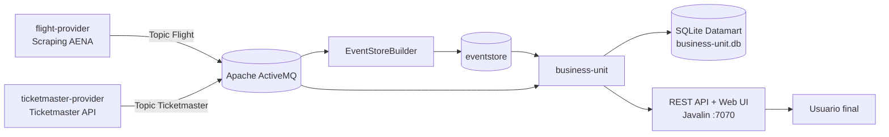

# Sistema de Recomendación de Viajes para Eventos Musicales

Este proyecto implementa una infraestructura distribuida y modular orientada a la ingesta, procesamiento, persistencia y exposición de recomendaciones de viajes optimizadas, combinando la oferta de conciertos musicales con la disponibilidad logística de vuelos comerciales.

Desarrollado como proyecto final para la asignatura **Desarrollo de Aplicaciones para Ciencia de Datos (DACD)** de la Universidad de Las Palmas de Gran Canaria.

---

## 1. Propuesta de Valor

La plataforma resuelve la complejidad de coordinar manualmente los itinerarios de transporte en torno a eventos culturales masivos. Su propósito es automatizar el cruce de datos en tiempo real e histórico de conciertos internacionales con los flujos de vuelos comerciales publicados por AENA, tomando como referencia el Aeropuerto de Gran Canaria (`LPA`).

El sistema calcula y genera de forma autónoma **tuplas optimizadas de viaje (Evento + Vuelo de Ida + Vuelo de Vuelta)** bajo ventanas temporales parametrizables. Esto permite transformar flujos masivos de datos dispersos en opciones logísticas inmediatas y seguras para el usuario final.

---

## 2. Estructura del Proyecto y Arquitectura

El ecosistema de la aplicación se divide en cuatro módulos independientes completamente desacoplados:

* **`flight-provider`:** Componente encargado de la captura de datos aéreos desde AENA mediante scraping/consulta HTTP y de la emisión de eventos de vuelos hacia el broker JMS en el topic `Flight`. No requiere API key de vuelos.
* **`ticketmaster-provider`:** Componente encargado de consumir la API de Ticketmaster para extraer e ingestar la programación de conciertos. Publica los eventos capturados en el topic `Ticketmaster`.
* **`EventStoreBuilder`:** Componente encargado de suscribirse a los topics `Flight` y `Ticketmaster` para construir el histórico del sistema en la carpeta `eventstore`.
* **`business-unit`:** Núcleo central del sistema. Integra el consumidor asíncrono JMS, el cargador de datos históricos (*event-store*), el Datamart SQLite, el motor analítico de recomendaciones y la API web de exposición.

### Arquitectura General



### Especificación de Diagramas de Clases

La documentación técnica incluye un diagrama de clases independiente para cada módulo del sistema:

* Diagrama de clases de `flight-provider`.
* Diagrama de clases de `ticketmaster-provider`.
* Diagrama de clases de `EventStoreBuilder`.
* Diagrama de clases de `business-unit`.

Toda la documentación técnica del flujo de control, la arquitectura modular de hilos y el modelado UML de persistencia y entidades se encuentra centralizada en:

**[Documentación de Arquitectura y Diagramas de Clases](./docs/architecture.md)**

---

## 3. Justificación Tecnológica

### Orígenes de Datos

* **Ticketmaster API:** Proporciona un esquema JSON normalizado y unificado a nivel global, con identificadores únicos, salas, ciudades, fechas, horas y URLs de eventos. Esta fuente garantiza estabilidad en la ingesta de conciertos frente a plataformas locales con estructuras menos homogéneas.
* **Scraping de AENA:** El módulo `flight-provider` obtiene los vuelos desde la información publicada por AENA. Esta decisión permite trabajar con datos reales de conectividad aérea sin depender de una API comercial de vuelos. El sistema filtra vuelos según aeropuerto de origen y destinos indicados en la ejecución.

### Event Store

El histórico del sistema se conserva en la carpeta `eventstore`, separando los mensajes por fuente:

```text
eventstore
├── Flight
│   └── flight-provider
└── Ticketmaster
    └── ticketmaster-provider
```

Este almacenamiento permite reconstruir el Datamart, repetir ejecuciones y demostrar el sistema sin depender siempre de nuevas capturas externas.

### Datamart Relacional (SQLite)

La persistencia de la Unidad de Negocio se realiza mediante un motor **SQLite** relacional embebido por los siguientes motivos:

1. **Integridad Referencial:** Garantiza mediante restricciones de clave foránea (*Foreign Keys*) que no existan recomendaciones huérfanas si un vuelo o evento base es modificado o cancelado.
2. **Consultas Combinatorias:** Permite ejecutar operaciones `JOIN` complejas y filtrado analítico por rangos de fecha y hora de manera eficiente.
3. **Portabilidad:** Centraliza el Datamart en un único archivo local (`business-unit.db`), eliminando la latencia de red y la sobrecarga de despliegue de un servidor de bases de datos externo.
4. **Simplicidad Operativa:** Facilita la ejecución local, la corrección y la defensa del proyecto.

---

## 4. Patrones y Principios de Diseño Aplicados

* **Arquitectura Dirigida por Eventos (EDA):** Comunicación totalmente asíncrona mediante un broker **JMS (Apache ActiveMQ)**. Los proveedores y la unidad de procesamiento no se conocen entre sí, lo que garantiza el aislamiento ante caídas o picos de carga.
* **Patrón Repository:** Segregación de la lógica SQL por tablas en clases dedicadas (`EventRepository`, `FlightRepository`, `RecommendationRepository`, `ConfigRepository`), aislando las consultas JDBC del resto de la aplicación.
* **Patrón Fachada (Facade):** La clase `DatamartRepository` unifica el acceso a todos los sub-repositorios, exponiendo una interfaz limpia hacia los servicios de negocio y la API web.
* **Event Store:** El módulo `EventStoreBuilder` conserva los mensajes recibidos desde el broker, permitiendo trazabilidad, reconstrucción del Datamart y reutilización de datos históricos.
* **Separación de Responsabilidades:** Cada módulo tiene una responsabilidad clara: captura de vuelos, captura de eventos, persistencia histórica o explotación analítica.
* **Inmutabilidad (Thread-Safety):** Las entidades del modelo se definen como objetos con estado controlado y sin modificación innecesaria después de su creación. Esto asegura mayor estabilidad ante accesos concurrentes de los hilos del servidor HTTP, la carga histórica y la inyección de datos del consumidor JMS.

---

## 5. Requisitos y Guía de Ejecución

### Prerrequisitos

* **Java Development Kit (JDK):** Versión 21 o superior.
* **Apache Maven:** Configurado en el entorno.
* **Apache ActiveMQ:** En ejecución en el puerto `61616`.
* **Conexión a Internet:** Necesaria para consultar Ticketmaster y AENA.
* **API Key de Ticketmaster:** Configurada mediante la variable de entorno `TICKETMASTER_KEY`.

No se requiere API key para los vuelos, ya que `flight-provider` obtiene los datos desde AENA.

### Configuración de Ticketmaster

Antes de ejecutar `ticketmaster-provider`, configure la variable de entorno:

```powershell
$env:TICKETMASTER_KEY="TU_API_KEY"
```

En Linux/macOS:

```bash
export TICKETMASTER_KEY="TU_API_KEY"
```

### Compilación

Desde la raíz del proyecto, donde reside el `pom.xml` padre, ejecute:

```bash
mvn clean compile
```

Para ejecutar los tests disponibles:

```bash
mvn test
```

### Orden de Ejecución

1. **ActiveMQ:** Asegúrese de tener el broker de mensajería iniciado (`activemq start` o servicio de Windows activo).
2. **Event Store:** Ejecute la clase principal `org.ulpgc.dacd.Main` del módulo `EventStoreBuilder`. Esto dejará activo el proceso encargado de escuchar los topics `Flight` y `Ticketmaster` y escribir los mensajes en `eventstore`.
3. **Unidad de Negocio:** Ejecute la clase principal `org.ulpgc.dacd.Main` del módulo `business-unit`. Esto levantará el Datamart SQLite, procesará el histórico de datos, generará recomendaciones, activará el servidor web y abrirá la escucha JMS.
4. **Proveedores:** Inicie las clases principales de los módulos `flight-provider` y `ticketmaster-provider` para activar la ingesta en tiempo real.

### Ejecución por Módulo

Ejecutar `EventStoreBuilder`:

```bash
mvn -pl EventStoreBuilder exec:java -Dexec.mainClass="org.ulpgc.dacd.Main"
```

Ejecutar `business-unit`:

```bash
mvn -pl business-unit exec:java -Dexec.mainClass="org.ulpgc.dacd.Main"
```

Ejecutar `flight-provider`:

```bash
mvn -pl flight-provider exec:java -Dexec.mainClass="org.ulpgc.dacd.Main" -Dexec.args="LPA MAD BCN"
```

El módulo `flight-provider` recibe los argumentos:

```text
<Origen> <Destino1> [Destino2...]
```

Ejecutar `ticketmaster-provider`:

```bash
mvn -pl ticketmaster-provider exec:java -Dexec.mainClass="org.ulpgc.dacd.Main" -Dexec.args="Madrid 24"
```

El módulo `ticketmaster-provider` recibe los argumentos:

```text
<Ciudad> <Intervalo_Horas>
```

---

## 🌐 6. Interfaz REST y Ejemplos de Uso

La aplicación expone sus servicios a través de un servidor **Javalin** integrado en el puerto `7070`.

La interfaz web principal está disponible en:

* **Ruta:** `GET http://localhost:7070/`

### 1. Obtener todas las recomendaciones

* **Ruta:** `GET http://localhost:7070/api/recommendations`
* **Formato de Respuesta (JSON):**

```json
[
  {
    "eventId": "Z7rGza1AdOk3v",
    "eventName": "Bad Bunny - DeBÍ TiRAR MáS FOToS World Tour",
    "eventCity": "Madrid",
    "eventDate": "2026-05-30",
    "eventStartTime": "21:00",
    "outboundFlightNumber": "UX9059",
    "outboundAirline": "Air Europa",
    "outboundOrigin": "LPA",
    "outboundDestination": "MAD",
    "outboundDepartureTime": "2026-05-30 07:00",
    "returnFlightNumber": "UX9160R",
    "returnAirline": "Air Europa",
    "returnOrigin": "MAD",
    "returnDestination": "LPA",
    "returnDepartureTime": "2026-05-31 12:30",
    "capturedAt": "2026-05-17T15:20:11.450Z"
  }
]
```

### 2. Obtener eventos cargados

* **Ruta:** `GET http://localhost:7070/api/events`

### 3. Obtener vuelos cargados

* **Ruta:** `GET http://localhost:7070/api/flights`

### 4. Consultar la configuración del algoritmo

* **Ruta:** `GET http://localhost:7070/api/config`

* **Formato de Respuesta (JSON):**

```json
{
  "originAirport": "LPA",
  "outboundMarginHours": 3,
  "returnMarginHours": 2,
  "defaultEventDurationHours": 3
}
```

### 5. Actualizar la configuración del algoritmo

* **Ruta:** `POST http://localhost:7070/api/config`
* **Body (JSON):**

```json
{
  "originAirport": "LPA",
  "outboundMarginHours": 3,
  "returnMarginHours": 2,
  "defaultEventDurationHours": 3
}
```

Al actualizar la configuración, la unidad de negocio reconstruye las recomendaciones con los nuevos parámetros.

### 6. Consultar estadísticas del sistema

* **Ruta:** `GET http://localhost:7070/api/stats`

* **Formato de Respuesta (JSON):**

```json
{
  "events": 120,
  "flights": 85,
  "recommendations": 24
}
```

---

## 7. Datos Generados de Ejemplo

El repositorio incluye datos generados de ejemplo que permiten comprobar el funcionamiento del sistema:

```text
eventstore/
business-unit.db
flights.db
```

La carpeta `eventstore` contiene muestras históricas de vuelos y eventos organizadas por fecha y fuente. El archivo `business-unit.db` contiene el Datamart utilizado por la unidad de negocio, y `flights.db` conserva datos relacionados con la captura de vuelos.

---

## 8. Demostración Funcional Recomendada

Para la defensa oral del proyecto se recomienda seguir este flujo:

1. Iniciar Apache ActiveMQ.
2. Ejecutar `EventStoreBuilder`.
3. Ejecutar `business-unit`.
4. Mostrar por consola la carga del histórico desde `eventstore`.
5. Ejecutar `flight-provider` con origen `LPA` y destinos como `MAD` o `BCN`.
6. Ejecutar `ticketmaster-provider` con una ciudad como `Madrid`.
7. Abrir `http://localhost:7070/`.
8. Consultar `/api/recommendations`, `/api/events`, `/api/flights`, `/api/config` y `/api/stats`.
9. Explicar una recomendación concreta relacionando evento, vuelo de ida y vuelo de vuelta.

Con este recorrido se demuestra la cadena completa de valor del sistema: captura de datos, publicación JMS, almacenamiento histórico, carga en Datamart, generación de recomendaciones y exposición al usuario final.
