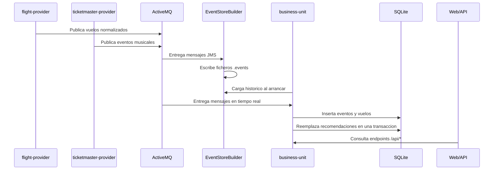
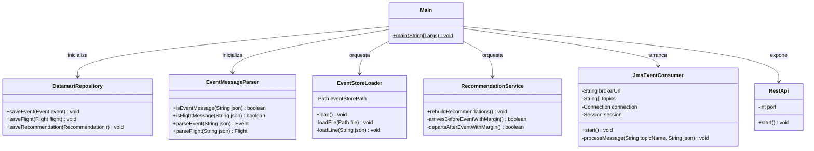
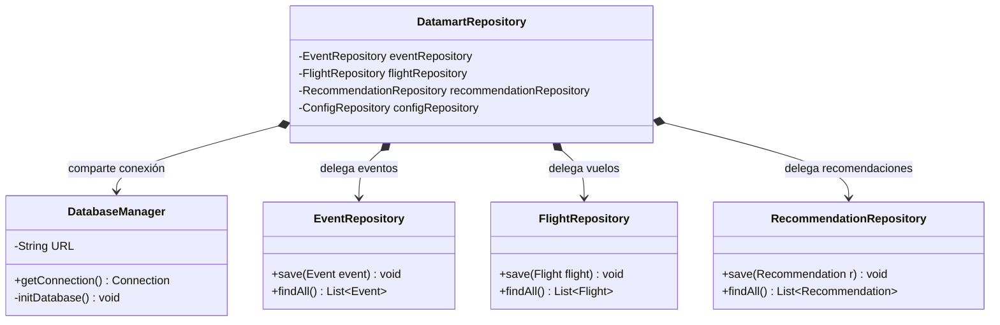
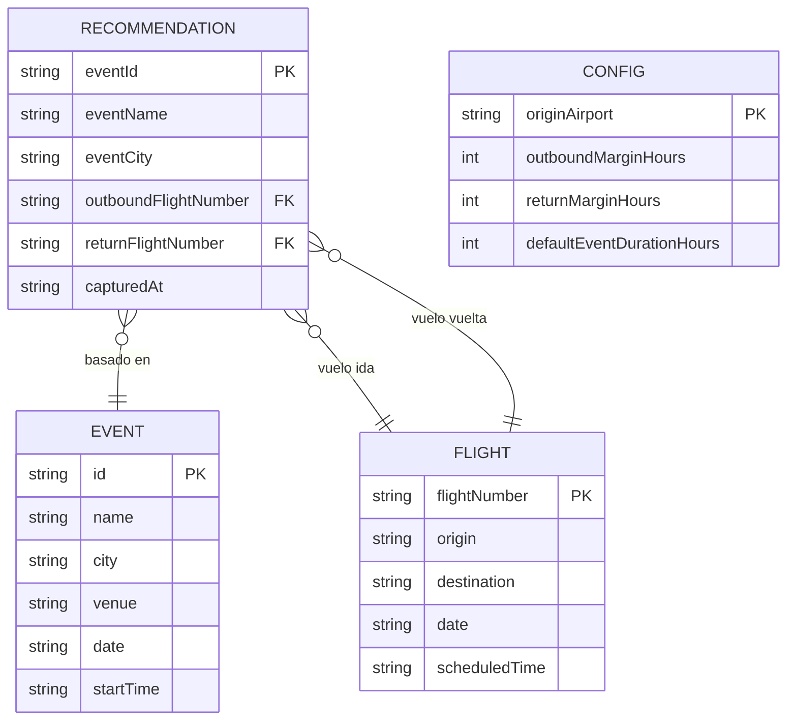

# Sistema de Recomendacion de Viajes para Eventos Musicales

Proyecto final de la asignatura **Desarrollo de Aplicaciones para Ciencia de Datos (DACD)**, Universidad de Las Palmas de Gran Canaria.

## Integrantes

- Integrante 1: `Marcos Pérez Pérez`
- Integrante 2: `César Luis Saavedra Vaca`

## 1. Descripcion

Este proyecto implementa una arquitectura distribuida para capturar, almacenar, procesar y exponer recomendaciones de viaje asociadas a eventos musicales. El sistema cruza eventos obtenidos desde Ticketmaster con vuelos reales publicados por AENA y genera recomendaciones formadas por:

- un evento musical
- un vuelo de ida desde `LPA` hacia la ciudad del evento
- un vuelo de vuelta desde la ciudad del evento hacia `LPA`

El sistema combina procesamiento en tiempo real mediante JMS con reconstruccion historica desde un Event Store local, por lo que puede regenerar el datamart y las recomendaciones a partir de datos ya capturados.

### Propuesta de Valor

La propuesta de valor consiste en **automatizar una tarea de planificación que normalmente requiere gran esfuerzo manual**: comprobar si existe una combinación viable entre la fecha y hora de un concierto, un vuelo que llegue al destino con margen suficiente antes del evento, y un vuelo de regreso tras su finalización. La unidad de negocio transforma datos dispersos y asíncronos en recomendaciones consolidadas, listas para ser consumidas fácilmente a través de una API REST y una interfaz web. Store local, por lo que puede regenerar el datamart y las recomendaciones a partir de datos ya capturados.

## 2. Modulos

El proyecto esta organizado como un proyecto Maven multi-modulo.

| Modulo | Responsabilidad |
| --- | --- |
| `flight-provider` | Consulta vuelos reales en AENA, normaliza los datos y publica mensajes en el topic `Flight`. |
| `ticketmaster-provider` | Consulta eventos musicales en Ticketmaster por ciudad y publica mensajes en el topic `Ticketmaster`. |
| `EventStoreBuilder` | Consume los topics JMS y persiste cada mensaje recibido en ficheros `.events`. |
| `business-unit` | Carga el Event Store, mantiene el datamart SQLite, calcula recomendaciones y expone API REST e interfaz web. |

## 3. Arquitectura y Diseño Técnico

El sistema adopta un enfoque orientado a eventos (EDA) acoplado a través de un broker de mensajería asíncrona, un Datamart relacional centralizado y un servidor web integrado para la exposición de servicios.

### 3.1. Flujo de Datos General



### 3.2. Arquitectura de Control y Componentes (`business-unit`)

La lógica de control del componente principal orquesta de forma simultánea la API REST, la lectura histórica de archivos y el receptor de eventos JMS, interactuando de forma unificada sobre la fachada del repositorio.



### 3.3. Capa de Persistencia (Patrón Repository y Facade)

El diseño del almacenamiento local sobre SQLite se organiza mediante la segregación de interfaces por tabla (Patrón Repository) y se consolida bajo un único punto de acceso unificado (Patrón Facade), ocultando la implementación interna de JDBC de las capas superiores.



## 4. Fuentes de Datos

### Justificación de la elección de APIs

Para nutrir el sistema, se han seleccionado dos fuentes de datos oficiales y fiables que evitan la fragilidad de técnicas como el *web scraping*:
- **Ticketmaster (Discovery API):** Elegida por ser el estándar de la industria en la venta de entradas. Su API REST ofrece un volumen masivo de eventos reales, con filtrado granular por ciudad, clasificación (música) y paginación, además de proporcionar metadatos estandarizados (fechas, horas, recintos).
- **AENA (Infovuelos):** Se seleccionó por ser la fuente oficial de la red de aeropuertos de España. Garantiza la obtención de vuelos reales y programados sin las limitaciones, bloqueos o baneos habituales que imponen las APIs de aerolíneas individuales o los agregadores comerciales tipo Skyscanner.

### AENA

`flight-provider` obtiene vuelos desde el servicio publico de Infovuelos de AENA. La consulta se realiza mediante `POST`, igual que la web de AENA, para obtener la ventana disponible de vuelos programados de hasta 14 dias.

Con los argumentos:

```text
LPA MAD BCN
```

el proveedor consulta los aeropuertos `LPA`, `MAD` y `BCN`, obtiene salidas (`S`) y llegadas (`L`), y conserva solo rutas reales entre:

- `LPA -> MAD`
- `MAD -> LPA`
- `LPA -> BCN`
- `BCN -> LPA`

No se generan vuelos inventados ni proyecciones artificiales. Los vuelos recomendados proceden de AENA y se filtran para que su fecha este dentro de la ventana real de captura (`ts` a `ts + 14 dias`).

### Ticketmaster

`ticketmaster-provider` consulta la API Discovery de Ticketmaster. La busqueda se hace por ciudad, con paginacion, eventos musicales (`classificationName=music`), pais `ES` y orden por fecha ascendente.

La clave de API debe estar disponible en la variable de entorno:

```text
TICKETMASTER_KEY
```

Cada mensaje publicado incluye:

- `ss`: sistema origen (`flight-provider` o `ticketmaster-provider`)
- `ts`: instante de captura en formato ISO

## 5. Persistencia

### Event Store

`EventStoreBuilder` escribe cada mensaje JMS como una linea JSON en ficheros `.events`.

Estructura generada:

```text
eventstore/
  Flight/
    flight-provider/
      20260520.events
  Ticketmaster/
    ticketmaster-provider/
      20260520.events
```

Cada fichero representa los mensajes de un topic, sistema origen y fecha de captura. `business-unit` puede reconstruir el datamart leyendo estos ficheros al arrancar.

### Datamart SQLite

`business-unit` genera el archivo `business-unit.db`. SQLite se utiliza por su portabilidad, simplicidad de despliegue y adecuacion para una demo academica local.

#### Estructura del Datamart

El esquema relacional centraliza la información mediante tablas independientes que se enlazan de forma lógica a través de la tabla de recomendaciones:


## 6. Motor de Recomendaciones

`RecommendationService` calcula recomendaciones a partir de eventos y vuelos cargados desde el Event Store o recibidos en tiempo real.

Reglas principales:

- descarta eventos sin fecha u hora valida
- descarta eventos auxiliares como parking
- agrupa variantes equivalentes de Ticketmaster en eventos canonicos
- descarta vuelos fuera de la ventana real de AENA (`ts` a `ts + 14 dias`)
- busca vuelos de ida que lleguen antes del evento respetando el margen configurado
- busca vuelos de vuelta que salgan despues del final estimado del evento
- limita el resultado a un maximo de 10 recomendaciones por evento visible
- ordena eventos y vuelos de forma determinista para evitar diferencias entre equipos
- reemplaza recomendaciones en bloque dentro de una transaccion
- recalcula recomendaciones cuando llegan eventos o vuelos nuevos

Los horarios de llegada se estiman por ruta para reflejar la hora local mostrada por buscadores de vuelos. Por ejemplo, la ruta `LPA -> BCN` usa una duracion local de 260 minutos, de modo que un vuelo `06:30` se muestra como llegada `10:50`.

Configuracion inicial del algoritmo:

| Campo | Significado | Valor inicial |
| --- | --- | --- |
| `origin_airport` | Aeropuerto base | `LPA` |
| `outbound_margin_hours` | Horas minimas entre llegada y evento | `3` |
| `return_margin_hours` | Horas minimas entre fin de evento y vuelta | `2` |
| `default_event_duration_hours` | Duracion estimada del evento | `3` |

## 7. Principios y Patrones Aplicados

El desarrollo se ha guiado por principios de código limpio y patrones de diseño estructurales y de comportamiento:

* **Arquitectura Dirigida por Eventos (EDA):** Los proveedores (`flight-provider` y `ticketmaster-provider`) publican en ActiveMQ y están totalmente desacoplados de la unidad de negocio.
* **Patrón Repository:** `EventRepository`, `FlightRepository`, `RecommendationRepository` y `ConfigRepository` encapsulan el acceso SQL.
* **Patrón Facade:** `DatamartRepository` centraliza el acceso al datamart, proporcionando una interfaz limpia a la API y al motor de recomendaciones.
* **Dependency Inversion Principle (DIP):** `RecommendationService` depende de la abstracción `RecommendationDataStore`, no de una implementación concreta de base de datos.
* **Inmutabilidad y Thread-Safety:** El modelo de dominio (`Event`, `Flight`, `Recommendation`) utiliza campos `private final` y carece de *setters*. Esto garantiza estabilidad ante llamadas concurrentes generadas por la API o el consumidor JMS.
* **Separación de Responsabilidades (SRP):** Procesamiento de JSON (`EventMessageParser`), persistencia, lógica de negocio y exposición web están estrictamente divididos en clases con una única razón para cambiar.
* **Arquitectura Kappa:** El sistema unifica el procesamiento histórico y en tiempo real bajo un único motor lógico (`business-unit`). No existen capas separadas para *batch* y *streaming* (como en Lambda); la reconstrucción del Datamart se realiza "reproduciendo" los eventos inmutables del Event Store mediante la misma lógica que procesa los mensajes entrantes de ActiveMQ.

## 8. Requisitos Previos

- JDK 21 o superior
- Apache Maven
- Apache ActiveMQ 5.x
- Conexion a internet para AENA y Ticketmaster
- Variable de entorno `TICKETMASTER_KEY`

ActiveMQ debe estar disponible en:

```text
tcp://localhost:61616
```

La consola web de ActiveMQ suele estar en:

```text
http://localhost:8161
```

## 9. Preparacion del Entorno

### Windows PowerShell

Configurar la clave de Ticketmaster para la sesion actual:

```powershell
$env:TICKETMASTER_KEY="TU_API_KEY"
```

Para dejarla persistente en Windows:

```powershell
setx TICKETMASTER_KEY "TU_API_KEY"
```

Tras usar `setx`, hay que cerrar y abrir de nuevo IntelliJ o la terminal para que la variable este disponible.

### IntelliJ IDEA

En cada configuracion de ejecucion:

1. Seleccionar el modulo correspondiente.
2. Seleccionar la clase `org.ulpgc.dacd.Main`.
3. Indicar los argumentos del programa cuando el modulo los necesite.
4. En `ticketmaster-provider`, comprobar que la variable `TICKETMASTER_KEY` esta disponible.

## 10. Compilacion y Tests

Desde la raiz del proyecto:

```bash
mvn clean compile
```

Ejecutar tests:

```bash
mvn test
```

## 11. Ejecucion

Orden recomendado:

1. ActiveMQ
2. `EventStoreBuilder`
3. `business-unit`
4. `flight-provider`
5. `ticketmaster-provider`

### 1. Iniciar ActiveMQ

```bash
activemq start
```

Si se quiere una prueba limpia, se recomienda purgar las colas/topics desde `http://localhost:8161` antes de arrancar los modulos.

### 2. Ejecutar EventStoreBuilder

Clase principal:

```text
EventStoreBuilder/src/main/java/org/ulpgc/dacd/Main.java
```

Clase Java:

```text
org.ulpgc.dacd.Main
```

Modulo de IntelliJ:

```text
EventStoreBuilder
```

Argumentos:

```text
Sin argumentos
```

Funcion:

- se conecta a ActiveMQ
- escucha los topics `Flight` y `Ticketmaster`
- escribe los mensajes recibidos en `eventstore/`

### 3. Ejecutar business-unit

Clase principal:

```text
business-unit/src/main/java/org/ulpgc/dacd/Main.java
```

Clase Java:

```text
org.ulpgc.dacd.Main
```

Modulo de IntelliJ:

```text
business-unit
```

Argumentos:

```text
Sin argumentos
```

Funcion:

- inicializa `business-unit.db`
- limpia eventos, vuelos y recomendaciones anteriores del datamart
- carga el historico desde `eventstore/`
- reconstruye recomendaciones
- se suscribe a ActiveMQ
- levanta la API REST y la interfaz web

URL:

```text
http://localhost:7070
```

### 4. Ejecutar flight-provider

Clase principal:

```text
flight-provider/src/main/java/org/ulpgc/dacd/Main.java
```

Clase Java:

```text
org.ulpgc.dacd.Main
```

Modulo de IntelliJ:

```text
flight-provider
```

Argumentos obligatorios:

```text
<AeropuertoBase> <Destino1> [Destino2...]
```

Ejemplo recomendado:

```text
LPA MAD BCN
```

Significado:

- `LPA`: aeropuerto base del usuario
- `MAD`: destino monitorizado Madrid
- `BCN`: destino monitorizado Barcelona

Con este ejemplo se capturan vuelos reales en ambos sentidos entre `LPA` y los destinos monitorizados. El proceso publica en ActiveMQ cada hora y tambien ejecuta una primera captura al arrancar.

### 5. Ejecutar ticketmaster-provider

Clase principal:

```text
ticketmaster-provider/src/main/java/org/ulpgc/dacd/Main.java
```

Clase Java:

```text
org.ulpgc.dacd.Main
```

Modulo de IntelliJ:

```text
ticketmaster-provider
```

Argumentos obligatorios:

```text
<Ciudad> <IntervaloHoras>
```

Ejemplos recomendados:

```text
Madrid 6
Barcelona 6
```

Significado:

- `Madrid` o `Barcelona`: ciudad consultada en Ticketmaster
- `6`: intervalo de captura en horas

Si se quieren capturar varias ciudades a la vez, se debe ejecutar una instancia del modulo por ciudad. Por ejemplo, una configuracion para `Madrid 6` y otra para `Barcelona 6`.

## 12. API REST e Interfaz Web

Servidor:

```text
http://localhost:7070
```

| Metodo | Ruta | Descripcion |
| --- | --- | --- |
| `GET` | `/` | Interfaz web. |
| `GET` | `/api/recommendations` | Lista de recomendaciones generadas. |
| `GET` | `/api/events` | Eventos cargados en el datamart. |
| `GET` | `/api/flights` | Vuelos cargados en el datamart. |
| `GET` | `/api/config` | Configuracion actual del algoritmo. |
| `POST` | `/api/config` | Actualiza la configuracion y recalcula recomendaciones. |
| `GET` | `/api/stats` | Contadores de eventos, vuelos y recomendaciones. |

### Obtener Recomendaciones

```bash
curl http://localhost:7070/api/recommendations
```

Respuesta de ejemplo:

```json
[
  {
    "eventId": "Z698xZ2qZ1k_K_JAU",
    "eventName": "Bad Bunny - DeBi TiRAR MaS FOToS World Tour",
    "eventCity": "Barcelona",
    "eventDate": "2026-05-22",
    "eventStartTime": "20:00:00",
    "eventEndTime": "23:00",
    "outboundFlightNumber": "3001",
    "outboundAirline": "Vueling",
    "outboundOrigin": "LPA",
    "outboundDestination": "BCN",
    "outboundDepartureTime": "2026-05-22 06:30",
    "outboundArrivalTime": "2026-05-22 10:50",
    "returnFlightNumber": "3010",
    "returnAirline": "Vueling",
    "returnOrigin": "BCN",
    "returnDestination": "LPA",
    "returnDepartureTime": "2026-05-23 10:10",
    "capturedAt": "2026-05-20T10:35:02Z"
  }
]
```

### Consultar Configuracion

```bash
curl http://localhost:7070/api/config
```

Respuesta:

```json
{
  "originAirport": "LPA",
  "outboundMarginHours": 3,
  "returnMarginHours": 2,
  "defaultEventDurationHours": 3
}
```

### Actualizar Configuracion

```bash
curl -X POST http://localhost:7070/api/config \
  -H "Content-Type: application/json" \
  -d "{\"originAirport\":\"LPA\",\"outboundMarginHours\":4,\"returnMarginHours\":2,\"defaultEventDurationHours\":3}"
```

### Consultar Estadisticas

```bash
curl http://localhost:7070/api/stats
```

Respuesta:

```json
{
  "events": 420,
  "flights": 3500,
  "recommendations": 80
}
```

## 13. Datos Generados

Durante la ejecucion se generan datos locales:

```text
eventstore/Flight/flight-provider/*.events
eventstore/Ticketmaster/ticketmaster-provider/*.events
business-unit.db
```

Estos ficheros son datos generados por la ejecucion. No sustituyen al codigo fuente ni a la documentacion.

Para una prueba desde cero:

1. Parar todos los modulos.
2. Purgar ActiveMQ desde `http://localhost:8161`.
3. Borrar `business-unit.db`.
4. Borrar `eventstore/` si se quiere descartar todo el historico.
5. Arrancar de nuevo en el orden indicado.