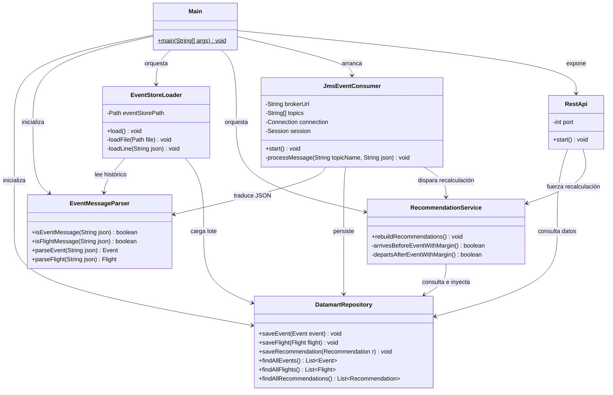
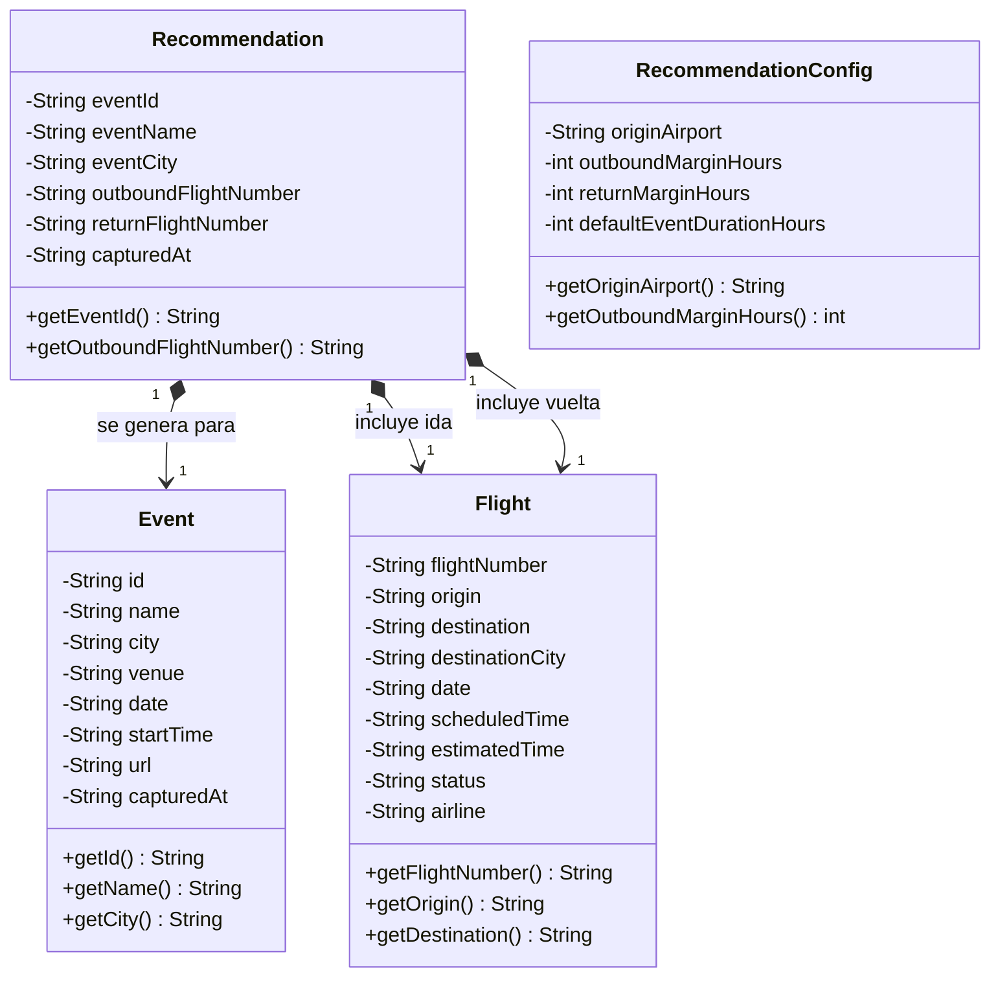

# Documentación de Arquitectura y Diagramas de Clases

Este documento detalla la arquitectura de software del sistema, enfocándose especialmente en el módulo central `business-unit`. La aplicación sigue un enfoque arquitectónico guiado por eventos (EDA - Event-Driven Architecture) totalmente desacoplado mediante un broker de mensajería (ActiveMQ), resistencia centralizada en un Datamart relacional (SQLite) y exposición dinámica de datos a través de una interfaz web integrada por una API REST (Javalin).

---

## 1. Arquitectura General y Flujo de Control (`business-unit`)

Este diagrama representa el núcleo de control y la orquestación de la Unidad de Negocio. Muestra cómo coordinan sus acciones la interfaz de la API web (`RestApi`), el cargador por lotes del histórico (`EventStoreLoader`) y el consumidor asíncrono en tiempo real (`JmsEventConsumer`), delegando el almacenamiento y la consulta de la información en la Fachada única del repositorio central.

### Argumentos clave para la defensa ante el tribunal:
* **Desacoplamiento asíncrono:** El componente `JmsEventConsumer` reacciona de manera pura a los tópicos del broker sin conocer el origen de los datos. Los capturadores externos (`flight-provider` y `ticketmaster-provider`) son completamente inmutables e independientes del destino.
* **Separación de Conceptos:** La clase `EventMessageParser` aísla de forma exclusiva la lógica de deserialización e interpretación de los payloads JSON, evitando que las clases de negocio o persistencia tengan que lidiar con dependencias directas de librerías de conversión.

---

## 2. Capa de Persistencia (Patrón Repository y Fachada Datamart)

Este diagrama detalla la arquitectura del almacenamiento relacional de SQLite dentro de la Unidad de Negocio. Implementa el patrón estructural **Repository** para subdividir las tareas SQL por tabla, agrupándolas formalmente bajo una estructura de **Fachada** (`DatamartRepository`) para simplificar su consumo externo.

### Argumentos clave para la defensa ante el tribunal:
* **Patrón Fachada (Facade):** Ningún elemento de control de la aplicación (`RestApi` o `RecommendationService`) tiene visibilidad directa de las sentencias SQL ni de los repositorios atómicos de las tablas. Esto permite sustituir el motor de base de datos en el futuro modificando únicamente este paquete cerrado.
* **Ciclo de vida centralizado:** La clase `DatabaseManager` asume de forma única la responsabilidad del mapeo inicial DDL (`CREATE TABLE IF NOT EXISTS`) y de proveer conexiones limpias a través de JDBC mediante bloques robustos de control de recursos.

---

## 3. Capa de Modelo (Entidades Inmutables / POJOs)

Representa los Objetos de Transferencia de Datos (`Plain Old Java Objects`) que fluyen verticalmente a través de todas las capas del sistema. Se ha priorizado el principio de **Inmutabilidad** declarando sus atributos como de lectura exclusiva (`private final`).

### Argumentos clave para la defensa ante el tribunal:
* **Thread-Safety implícito:** Al carecer de métodos modificadores de estado (`setters`), estos objetos son inherentemente seguros frente a accesos concurrentes de hilos paralelos. Esto es crítico dado que el servidor HTTP (`Javalin`) atiende peticiones de clientes simultáneamente mientras el consumidor ActiveMQ procesa flujos de entrada.
* **Alineación Conceptual:** La recomendación no almacena referencias de memoria vivas a los objetos para evitar acoplamientos rígidos en el almacenamiento persistente; en su lugar, mapea claves descriptivas e identificadores formando una estructura óptima para su rápido renderizado en la interfaz web.