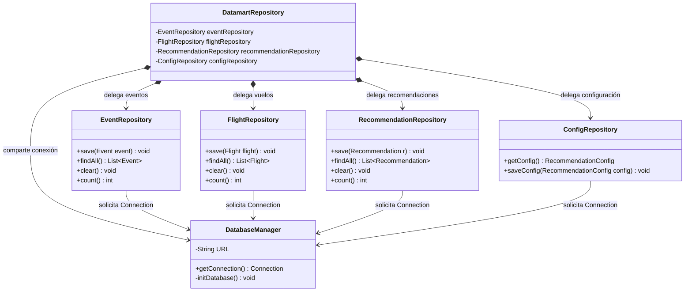
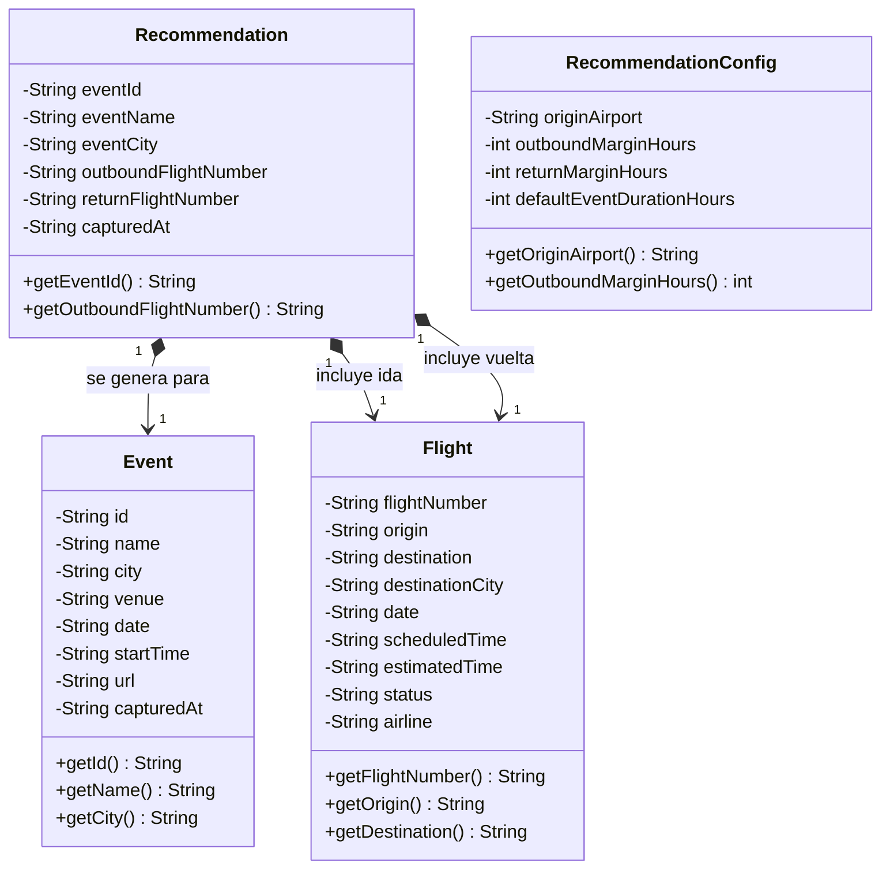

# Documentación de Arquitectura y Diseño Técnico

Este documento describe la especificación técnica de la arquitectura de software implementada, centrada en el módulo de procesamiento `business-unit`. El sistema adopta un enfoque orientado a eventos (EDA) acoplado a través de un broker de mensajería asíncrona, un Datamart relacional centralizado y un servidor web integrado para la exposición de servicios.

---

## 1. Arquitectura de Control y Flujo del Sistema (`business-unit`)

El siguiente esquema representa la estructura de hilos y la lógica de control del componente principal. Ilustra la interacción simultánea entre la API REST (`RestApi`), el módulo de lectura histórica de archivos (`EventStoreLoader`) y el receptor de eventos de mensajería (`JmsEventConsumer`), interactuando de forma unificada sobre la fachada del repositorio.

### Especificaciones de Diseño:
* **Desacoplamiento de Red:** Los productores externos (`flight-provider` y `ticketmaster-provider`) interactúan únicamente con el Broker de ActiveMQ, garantizando que el origen de datos y el motor de procesamiento sean independientes.
* **Procesamiento de Payloads:** La lógica de análisis e interpretación de cadenas JSON se centraliza en `EventMessageParser`, encapsulando los esquemas externos fuera de las clases de almacenamiento.

---

## 2. Capa de Persistencia (Patrón Repository y Fachada Datamart)

Este diagrama detalla el diseño estructural del almacenamiento local sobre SQLite. Se organiza mediante la segregación de interfaces por tabla (Patrón Repository) y se consolida bajo un único punto de acceso unificado (Patrón Facade).

### Especificaciones de Persistencia:
* **Abstracción del Motor:** El uso de `DatamartRepository` como fachada oculta la implementación interna de JDBC y las sentencias SQL de las capas superiores de lógica de negocio (`RestApi` y `RecommendationService`).
* **Ciclo de Vida de Conexiones:** `DatabaseManager` asume de forma única la apertura de flujos y la verificación/inicialización de las tablas de datos (`DDL`) durante el ciclo de arranque.

---

## 3. Capa de Modelo (Entidades Inmutables)

Estructura de las clases POJO (`Plain Old Java Objects`) utilizadas para el transporte horizontal de información entre módulos. El diseño prioriza restricciones de inmutabilidad en las propiedades de los datos mapeados.

### Especificaciones de Modelo:
* **Estructura Segura (Thread-Safety):** Al prescindir de métodos modificadores (`setters`), los objetos de datos son intrínsecamente estables ante llamadas concurrentes asíncronas generadas por los hilos concurrentes del servidor web o los consumidores de la cola.
* **Estructura Desacoplada:** El modelo evita enlaces directos por puntero entre instancias de memoria vivas dentro del Datamart; las entidades se vinculan mediante indexación de identificadores descriptivos.